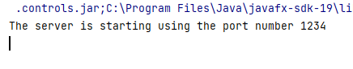
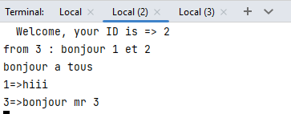
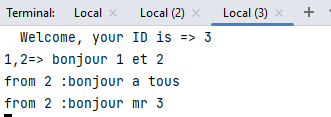
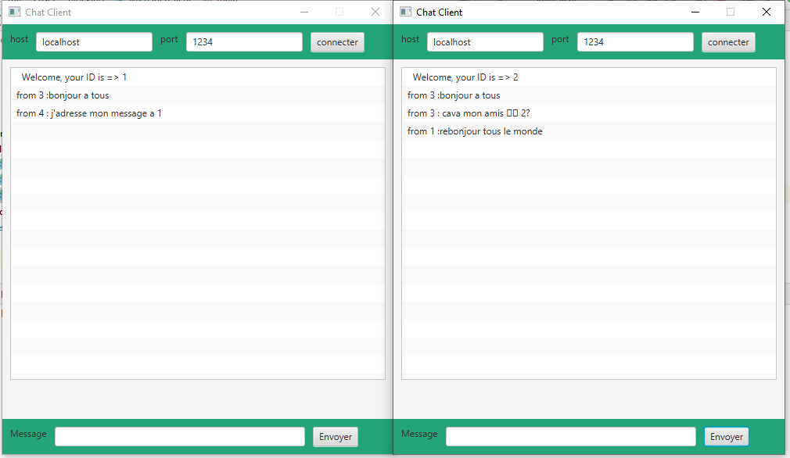
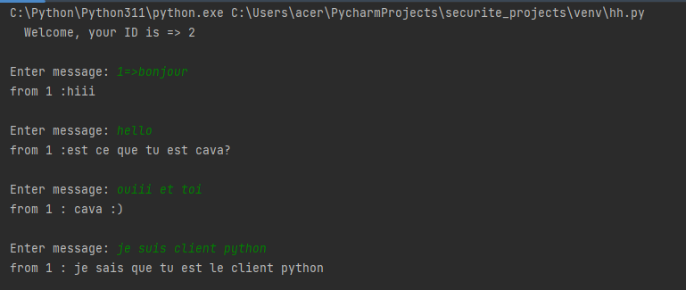
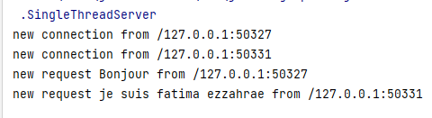
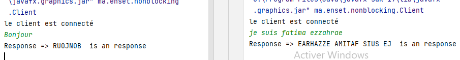
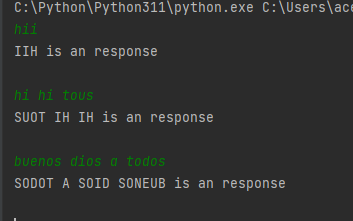

<h1> Compte rendu </h1>
<h2> 1-Modèle Multi Threads Blocking IO</h2>
<h6>En programmation réseau, le modèle blocking (ou modèle bloquant) fait référence à une approche où l'exécution d'une application est bloquée jusqu'à ce qu'une opération de réseau soit terminée.
lorsqu'une application effectue une opération de réseau, telle qu'une demande de lecture ou d'écriture sur un socket, l'application est bloquée jusqu'à ce que l'opération soit terminée. Cela signifie que l'application ne peut pas continuer à exécuter d'autres tâches pendant que l'opération de réseau est en cours.</h6>
<h3> un serveur de Multi Thread Blocking IO de ChatServer </h3>

<h3> Teste du serveur avec un client Telnet</h3>

<h3> un client Java avec une interface graphique JavaFX</h3>

<h3> un client Python </h3>

<h2> 2-Modèle Single Thread avec Non Blocking IO </h2>
<h6>Le modèle non bloquant (ou non bloquant) en Java permet à un thread de gérer de nombreuses connexions simultanément sans bloquer l'exécution en attendant une opération de lecture ou d'écriture sur une connexion donnée. Au lieu de cela, il utilise une approche basée sur des événements pour gérer les connexions de manière asynchrone.</h6>
<H6>Dans le modèle non bloquant, une seule thread est capable de gérer plusieurs canaux (connections) simultanément en utilisant des opérations d'entrée-sortie non bloquantes. Cela permet à un programme de traitement de haute performance de traiter plusieurs connexions simultanément sans bloquer l'ensemble du programme.</h6>
<h3> un serveur de Single Thread  utilisant des entrées sorties non bloquantes </h3>

<h3>Teste du serveur avec un client java </h3>

<h3>Teste du serveur avec un client python</h3>

      
